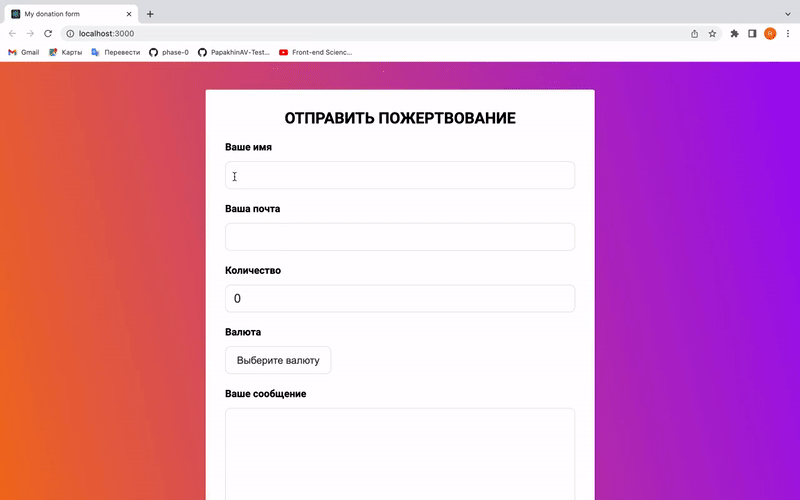
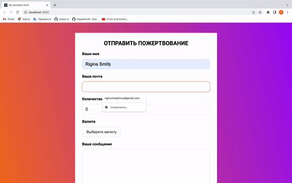
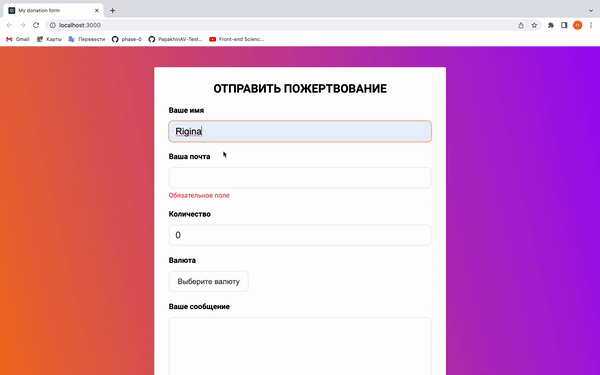
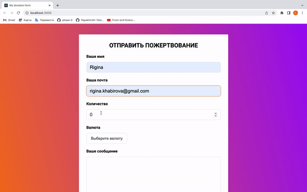

# React форма для донатов с использованием библиотеки Formik
## Стэк - React, JS, HTML, CSS, Formik, Yup
### Разработчик:
- [Ригина П.]

### Форма позволяет:
- Получить имя, email пользователя 
- Установить сумму и валюту пожертвования
- Получить дополнительное сообщение от пользователя
- Получить согласие пользователя на обработку данных
#
### `Оповещение пользователя о незаполненных полях`

#
### `Пользователь указывает имя`

#
### `Пользователь указывает email`

#
### `Получение информации о сумме и валюте пожертвования`
 

#
### `Получение сообщения `
 
![userMessage](gifs/message.gif
#
### `Получение согласия на обработку `
 

[Ригина П.]: https://github.com/riginapapakhina

